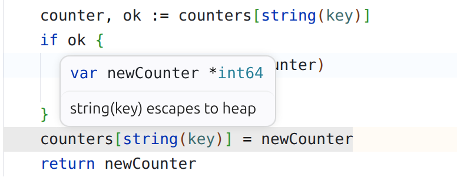

# Go Escape Highlighter

Highlights lines reported by `go build -gcflags=-m`:

- **Orange** — variable escapes to heap
- **Blue** — inlining call
- **Green** — devirtualized interface call

Analysis runs automatically on save. Use **Go: Analyze Heap Escapes** from the Command Palette to run manually.

## Settings

| Setting | Default | Description |
|---|---|---|
| `goEscape.autoAnalyze` | `true` | Run analysis automatically on save |
| `goEscape.enableEscapeHighlight` | `true` | Show heap escape lines |
| `goEscape.enableInlineHighlight` | `true` | Show inlining lines |
| `goEscape.enableDevirtHighlight` | `true` | Show devirtualization lines |
| `goEscape.escapeColor` | `rgba(255,160,0,0.04)` | Heap escape highlight color |
| `goEscape.inlineColor` | `rgba(100,180,255,0.04)` | Inlining highlight color |
| `goEscape.devirtColor` | `rgba(100,220,120,0.04)` | Devirtualization highlight color |

